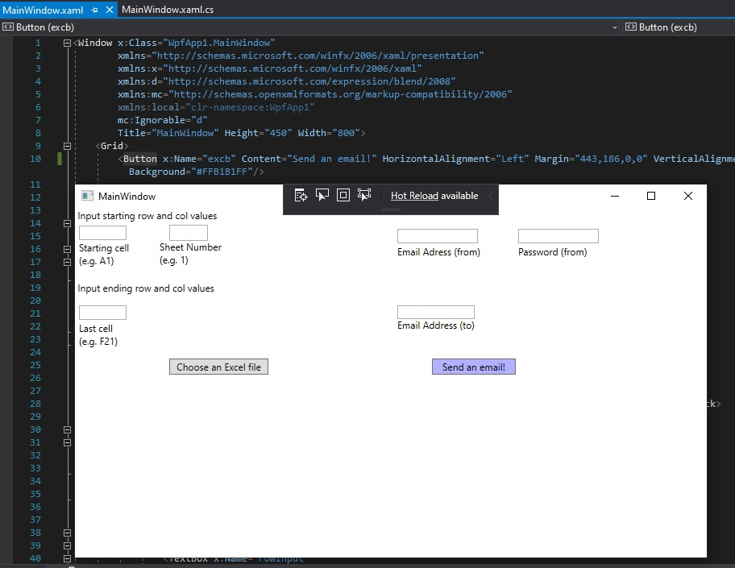
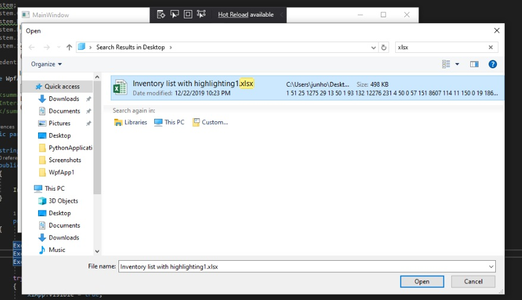
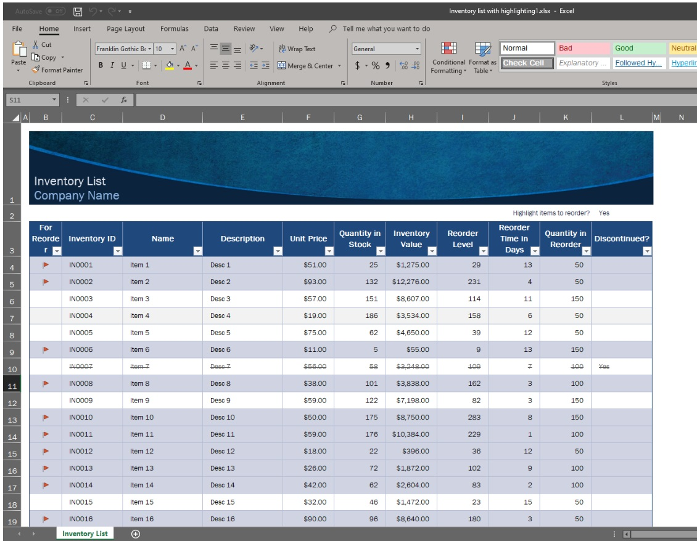
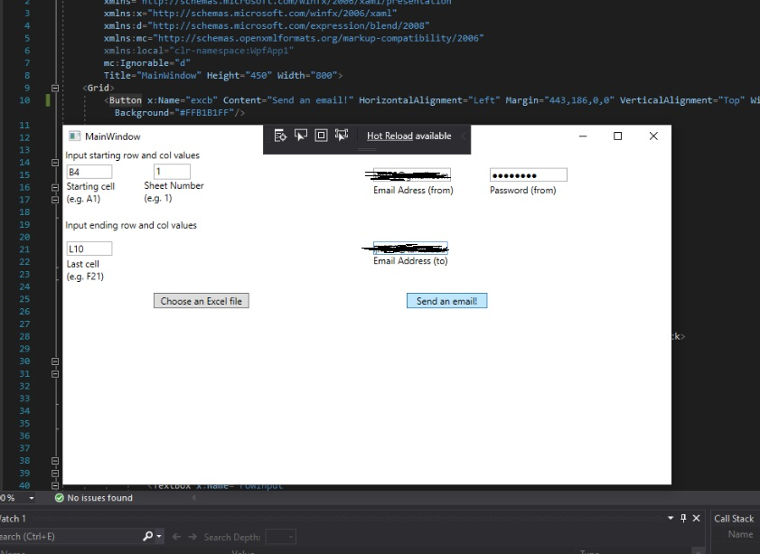
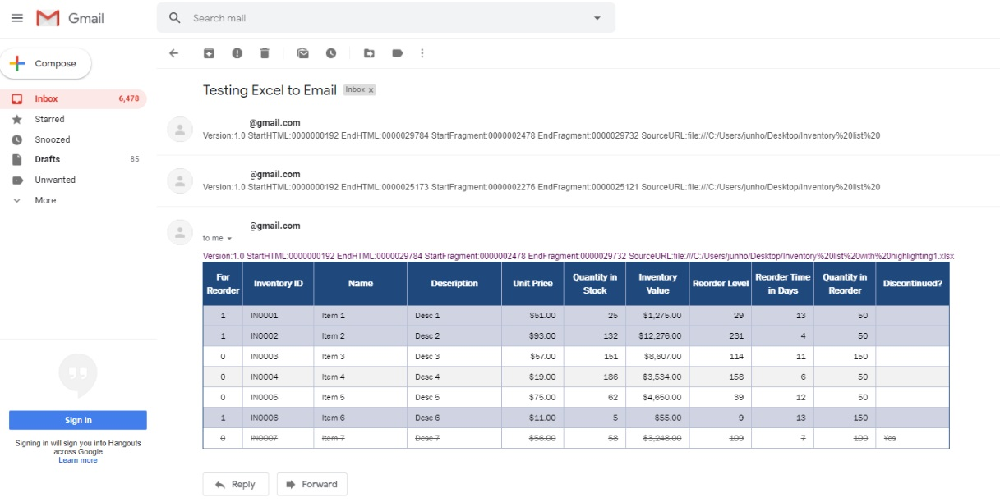

# Simple-Excel-to-Email-Program
A simple C#(.Net) program to share data from excel via email without destroying the design/format.

How to use:

1. Download and run the code in Visual Studio

2. Click the "Choose an excel file" button and select one.

Figure 1. Sample excel chart file

3. Fill the boxes and press "Send and email!" button.

Figure 2. Completed.
